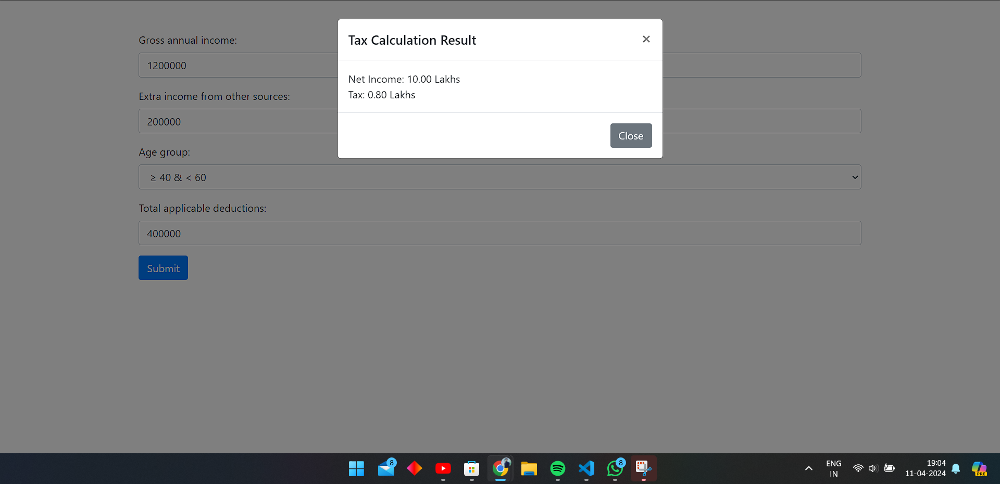
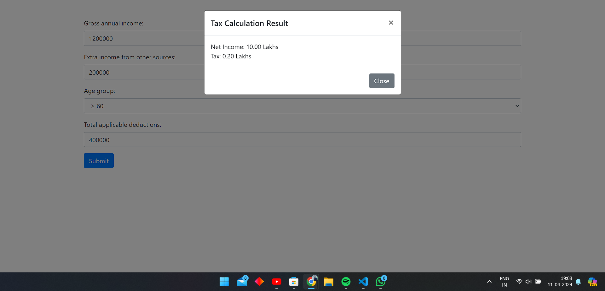
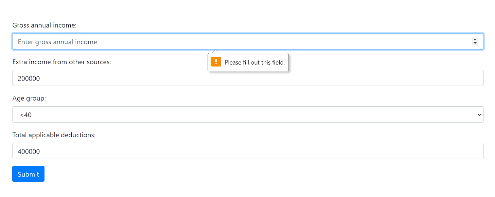

    web app deploed on vercel :https://fyle-webd.vercel.app/
    video: https://res.cloudinary.com/drqcugtxy/video/upload/v1712845927/2024-04-11_19-42-20___ll7zde.mp4

    - Gaurav Bhatt
    portfolio :https://portfolio-zeta-six-85.vercel.app/
    LinkedIn : https://www.linkedin.com/in/golubhattuk01/
    resume :https://drive.google.com/file/d/112mKGF6FLwukA0mzI3mLx6_-U9CMWcnB/view?usp=sharing

Income over 8 (>) Lakhs, the amount over 8 Lakhs is taxed at

- 30% for people with age < 40
- 40% for people with age ≥ 40 but < 60
- 10% for people with age ≥ 60

examples
a person having 12 lakh gross income , 4 lakhs is total applicable deductions and the extra income

-->>>> if person is under 40
he will pay 0.60 lakhs

-->>>> if person is lies between 40 and 60
he will pay 0.80 lakhs

-->>>> if person is over
he will pay 0.20 lakhs

if we don't fill mandatory fields we get error like this

